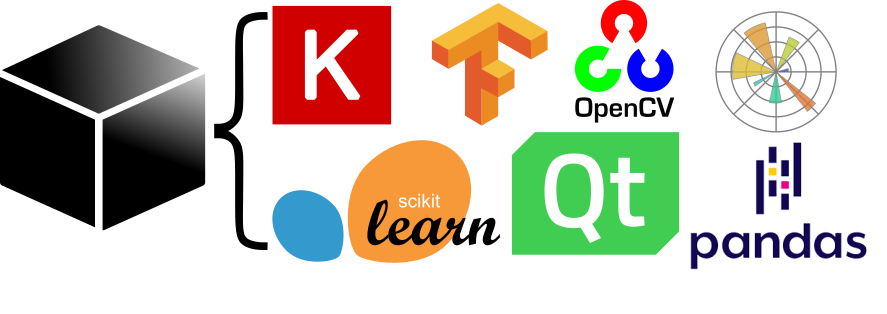
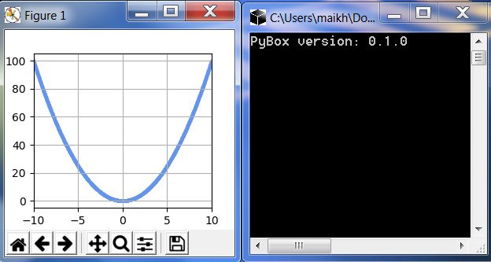
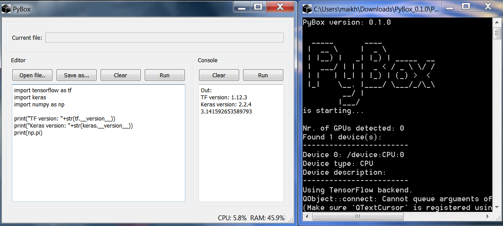

# PyBox
  

"Just quickly install Anaconda and Python package x,y,z": you maybe already 
said this to someone who wants to execute your Python code. Secretly, you fear that
this task will not be done "quickly"  because there is always some error. Installing
Python and dependencies can take day(s) and end in frustration or even capitulation. 
As a result, your code may not be used by others.

Now comes PyBox: PyBox is Python in a .zip file. Just download it - unzip and run it (by double-clicking PyBox_0.1.0.exe) - Batteries are included.
PyBox provides popular Python packages like Scikit-learn, Tensorflow (with GPU support!), Keras, OpenCV, Matplotlib, PyQt5, Pandas, NumPy and many more!
PyBox is available for CPU and GPU. The GPU version comes readily equipped with CUDA.


After unzipping, you find lots of files in that folder: this is everything needed for
Python to run. Don't touch!  
Also, you also find 3 Python scripts:
* pybox_start.py
* frontend.py  
* backend.py
You can modify these files entirely to your need. Examples below:

# As simple as it gets  
Let's just write a script to draw a parabola
```
import numpy as np
import matplotlib.pyplot as plt

def pybox_start():
    a = np.linspace(start=-10.0,stop=10,num=1000)
    b = a**2
   
    plt.figure(1,figsize=(4,4))
    plt.scatter(a,b,s=10,c="cornflowerblue",linewidth="0",facecolors='none',edgecolors='black',alpha=1)
    plt.xlabel("x")
    plt.ylabel("y")
    
    plt.grid()
    plt.xlim(-10,10)
    plt.show()
```
Insert this code into pybox_start.py. For this app, you dont need a GUI. Hence,
you create and empty script called "frontend.py" and paste it into the PyBox folder (replace the existing frontend.py).
Do the same for backend.py.
Now you can double-click PyBox_0.1.0.exe and the result looks like this:  
  

# Fancy GUI: Create a Python editor/console  
You want to have a software with user-interface for example to distribute some
machine learning/ deep learing toolkit. 
When double-clicking PyBox_0.1.0.exe, first, the script pybox_start.py is executed.
Within pybox_start.py, you have only a few functions that manage the startup of PyBox.
These functions should not be renamed to take effect:
* splashscreen: Use this function to define a splashscreen
* pybox_start: Arbitrary code that should be executed before opening the GUI (e.g. plot a banner to the console)  
* pybox_main: Defines the main loop (starts GUI)

The function pybox_main imports frontend.py and starts the GUI. You can modify frontend.py
entirely to your need. QtDesigner is a great tool to design a GUI. 

Finally, you can outsource functions to backend.py. The example shows how to import 
the backend and employ it.

In the example, I defined a small app that allows to write and execute Python code.
Just copy and paste pybox_start.py, frontend.py, and backend.py into your PyBox folder. After running PyBox, you should
see something like that:  
  


# Which packages are contained in PyBox? 
The PyBox environment was created using Anaconda and the following commands
```
conda create -n pybox_gpu python=3.5
activate pybox_gpu
pip install --upgrade setuptools
pip install matplotlib==3.0.3
pip install keras==2.2.4
pip install tensorflow-gpu==1.12.3
pip install scikit-learn==0.20.0
pip install dclab==0.22.1
pip install Pillow==5.4.1
pip install pandas==0.24.0 
pip install psutil==5.4.7
pip install mkl==2019.0
pip install pyqt5==5.9.2
pip install pyqtgraph==0.11.0
pip install imageio==2.4.1
pip install opencv-contrib-python-headless==4.4.0.42
pip install openpyxl==2.5.6
pip install xlrd==1.1.0
pip install keras2onnx==1.4.0
pip install libopencv==0.0.1
pip install ffmpeg==1.4
pip install tf2onnx==1.4.1
pip install numpy==1.16.4
```


